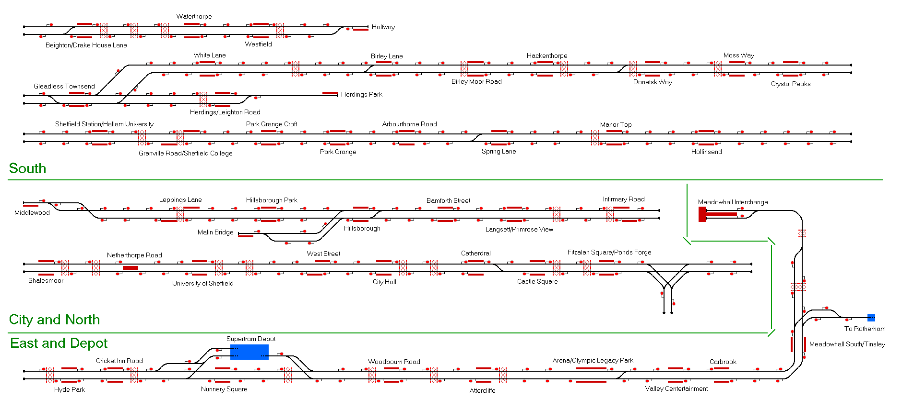

# Sheffield Supertram, South Yorkshire

This map represents the Sheffield Supertram, a tram system around the Yorkshire city of Sheffield.

## Current Status

| Stage         | Status        |
| ------------- |:-------------:|
| Track Plan     |  |
| Signalling      |       |
| Naming |       |
| Speed Limits |  |
| Distances |  |
| Timetable |  |
| Documentation |  |

Status icons by Freepik, pixelmeetup, Pixel Perfect on FlatIcon.com.
